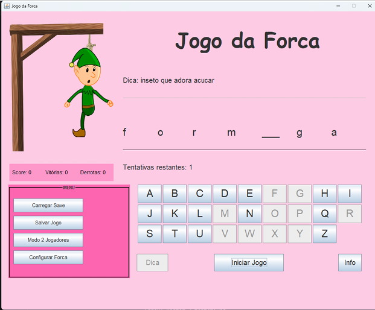
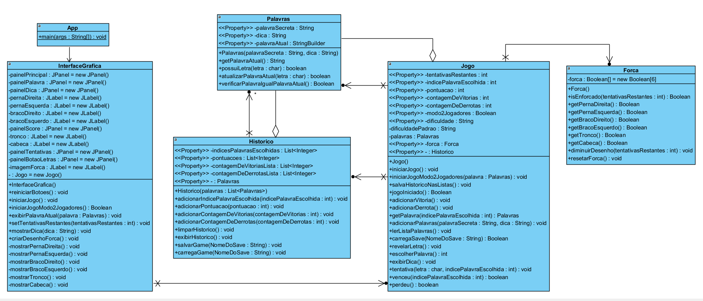

# Jogo da Forca

Este é um projeto de um clássico jogo da forca desenvolvido em Java. O programa foi criado para ser uma experiência interativa, desafiando os jogadores a adivinhar uma palavra secreta por meio de tentativas de letras. O desenvolvimento foi orientado a objetos, buscando criar um código com alta coesão e baixo acoplamento.

---

## Captura de Tela do Jogo



---

## Funcionalidades

- **Interface Gráfica**: O jogo utiliza uma interface gráfica para a interação do jogador, com painéis e botões para jogar.
- **Modo 2 Jogadores**: Permite que um jogador insira uma palavra secreta e uma dica para que um amigo adivinhe.
- **Níveis de Dificuldade**: O jogador pode configurar a dificuldade das palavras, escolhendo entre as opções "Fácil", "Média" e "Difícil" através de um menu.
- **Sistema de Pontuação**: A pontuação é baseada na quantidade de letras corretas, com uma penalidade de 10 pontos por erro. Palavras de dificuldade média somam 50 pontos extras e as difíceis somam 100 pontos extras.
- **Salvar e Carregar Jogo**: O jogador pode salvar o histórico do jogo e a pontuação em um arquivo. É possível carregar um jogo salvo para recuperar o histórico de vitórias, derrotas e a pontuação.
- **Dica**: Um botão "Dica" está disponível para revelar uma letra aleatória da palavra secreta.
- **Informações**: Um botão "Info" exibe uma tela com as instruções e a descrição das funcionalidades do jogo.

## Funcionalidade de Salvar e Carregar (Save/Load)

O jogo permite que o jogador salve seu progresso e o retome mais tarde.

### **Salvar Jogo**

- Ao clicar no botão "Salvar Jogo", uma janela pop-up solicita que o usuário digite um nome para o save.
- O sistema então cria um arquivo de texto (`.txt`) na pasta `src` com o nome fornecido.
- Neste arquivo, são gravadas informações como a pontuação, o número de vitórias e derrotas, e as palavras utilizadas nas partidas anteriores.
- O método `salvarGame` na classe `Historico` é responsável por escrever os dados no arquivo. Cada linha do arquivo contém: pontuação, contagem de vitórias, contagem de derrotas, índice da palavra escolhida e a palavra secreta.

### **Carregar Jogo**

- Ao clicar no botão "Carregar Save", uma janela solicita o nome do arquivo de save que o usuário deseja carregar.
- O arquivo de save deve estar localizado na pasta `src` do projeto.
- O sistema lê o arquivo e restaura o histórico de derrotas, vitórias e a pontuação que o jogador tinha no momento em que salvou.
- O método `carregaGame` na classe `Historico` lê o arquivo e popula as listas de histórico com os dados salvos. Em seguida, a classe `Jogo` utiliza esses dados para atualizar o estado da partida atual.

## Como Compilar e Executar

É necessário ter o Java Development Kit (JDK) instalado no sistema para compilar e executar o jogo.

## Estrutura de Classes

O projeto é dividido em múltiplas classes principais que gerenciam a lógica do jogo e a interface.

- **`App`**: É a classe de entrada do programa. Seu método `main` é responsável por instanciar a `InterfaceGrafica` e iniciar o jogo.
- **`InterfaceGrafica`**: Gerencia toda a interação com o jogador através de uma interface gráfica. Ela cria e organiza os painéis, botões e exibe o estado atual do jogo.
- **`Jogo`**: Centraliza e gerencia a lógica principal do jogo. Controla a palavra atual, o número de tentativas, a pontuação e os erros cometidos pelo jogador.
- **`Forca`**: Modela a lógica da forca, controlando a exibição das partes do boneco com base nos erros do jogador.
- **`Palavras`**: Armazena o conjunto de palavras que podem ser usadas no jogo. É responsável por fornecer uma palavra aleatória para cada nova rodada.
- **`Historico`**: Responsável por armazenar e gerenciar o histórico das partidas, permitindo salvar e carregar o progresso do jogo.

## Como Compilar e Executar

É necessário ter o Java Development Kit (JDK) instalado no sistema para compilar e executar o jogo.

### **Compilação**

1.  Navegue pelo terminal até a pasta onde os arquivos do projeto estão localizados.
2.  Execute o comando a seguir para compilar os arquivos Java:
    ```bash
    javac -d bin src/*.java
    ```
    Este comando compila todos os arquivos `.java` da pasta `src` e coloca os arquivos `.class` resultantes na pasta `bin`.

### **Execução**

1.  Após a compilação, acesse a pasta `bin`.
2.  Execute o seguinte comando para iniciar o programa:
    ```bash
    java App
    ```

## Conceitos de Programação Aplicados

- **Orientação a Objetos (POO)**: A implementação segue os princípios da POO, organizando o código em classes modulares e reutilizáveis.
- **Encapsulamento**: Cada classe possui seus próprios atributos e métodos, encapsulando o comportamento e os dados de uma funcionalidade específica.
- **Herança**: O projeto utiliza herança, como na classe de interface que estende `JFrame`.
- **Modularização**: O código foi dividido em várias classes com responsabilidades específicas, promovendo um design modular.
- **Persistência de Dados**: A classe `Historico` armazena e recupera informações de partidas anteriores. O jogo também carrega palavras de arquivos `.txt` externos.

Um diagrama UML detalhado, ilustrando a relação entre todas as classes, está disponível abaixo.

